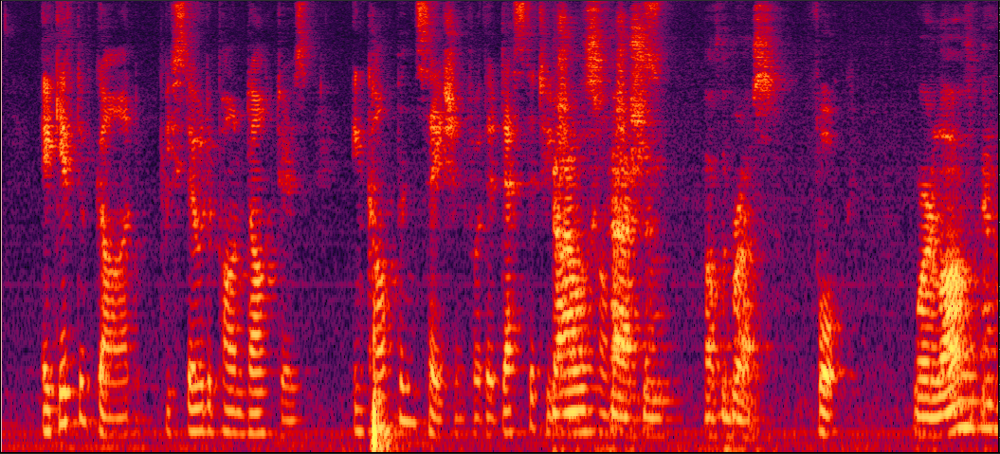

## WDASnet

Authors: Yi Yang, Hangting Chen, Pengyuan Zhang
Key Laboratory of Speech Acoustics and Content Understanding, Institute of Acoustics, Chinese Academy of Sciences, Beijing, China

We propose a weighted-direction-aware speech separation network (WDASnet) to achieve a DOA-assisted speech separation on sparsely overlapped mixtures in a multi-people meeting environment. 
First, based on the Convolutional Recurrent Neural Network (CRNN) DOA-estimation model, we provide a variant system by leveraging a weighted-pooling block which reduces the influence of silent and interference speaker frames. 
Second, we achieve an end-to-end utterance-wise DOA-estimation. No prior VAD, pre-extraction with adaptation utterance information or post-processing is needed. 
Third, we take a deep look of our system into multi-people meeting environment.

### Demos

mixture (overlap=0.5)

<audio src="/wav/mix-overlap0.5.wav" controls="controls"> </audio>

oracle

  
   

<audio src="/Oracle-s1.wav" controls="controls"> </audio> <audio src="/Oracle-s2.wav" controls="controls"> </audio>

BLSTM sep (sdr=2.39dB)

  
   

<audio src="/wav/BLSTM-s1.wav" controls="controls"> </audio> <audio src="/wav/BLSTM-s2.wav" controls="controls"> </audio>

BLSTM sep with average-pooling DoA estimation (sdr=5.72dB)

  
   

<audio src="/wav/Average-pooing-s1.wav" controls="controls"> </audio> <audio src="/wav/Average-pooing-s2.wav" controls="controls"> </audio>

BLSTM sep with oracle AF (sdr=13.92dB)

  
   

<audio src="/wav/BLSTM-AF-s1.wav" controls="controls"> </audio> <audio src="/wav/BLSTM-AF-s2.wav" controls="controls"> </audio>

BLSTM sep with proposed weighted-pooling DoA estimation (WDASnet) (sdr=14.62dB)

  
   

<audio src="/wav/Proposed-s1.wav" controls="controls"> </audio> <audio src="/wav/Proposed-s2.wav" controls="controls"> </audio>

### Example1

This illustration is the same with Fig.2 in the paper.
Visualization of the estimated weight. Three pairs of blocks from left to right refer to speech of target speaker, silent frames and overlapped speech, respectively.

<audio src="/wav/overlap0.2_4381-1296.wav" controls="controls"> </audio>

### Example2

Example2 shows the variation of estimated weights in condition of different sirs (-5,0,5dB)

  
   
   

<audio src="/wav/overlap0.4-sx408-si1993 -5dB.wav" controls="controls"> </audio> <audio src="/wav/overlap0.4-sx408-si1993 0dB.wav" controls="controls"> </audio> <audio src="/wav/overlap0.4-sx408-si1993 5dB.wav" controls="controls"> </audio>

### Questions

If you have any advice or questions, please contact us.

